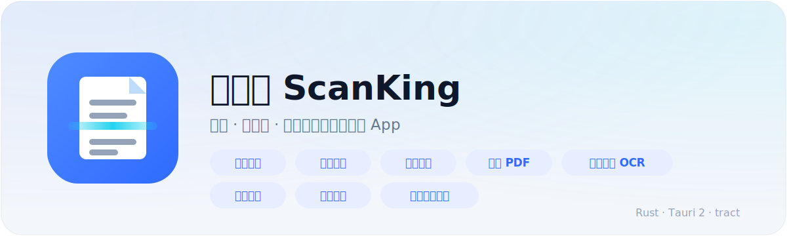
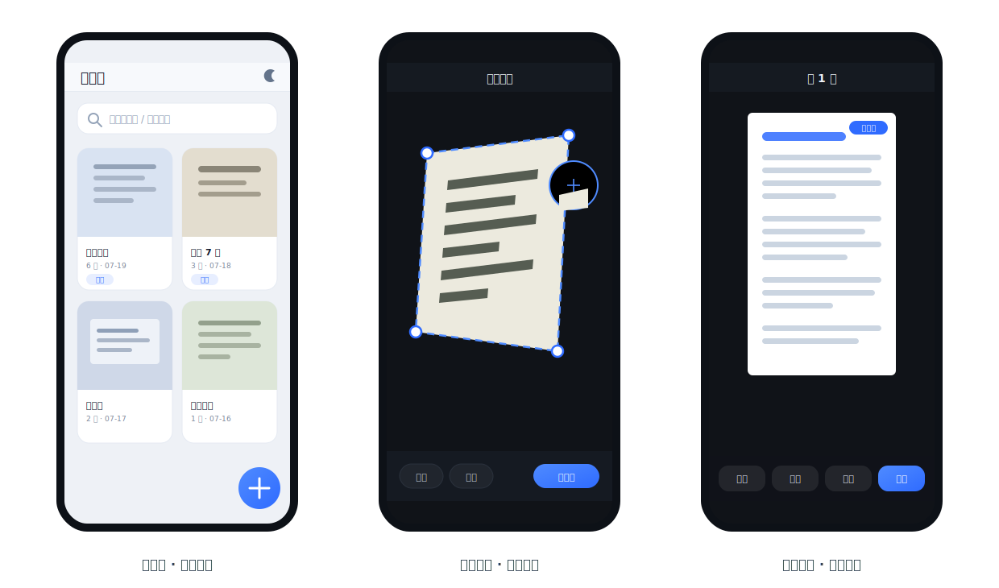
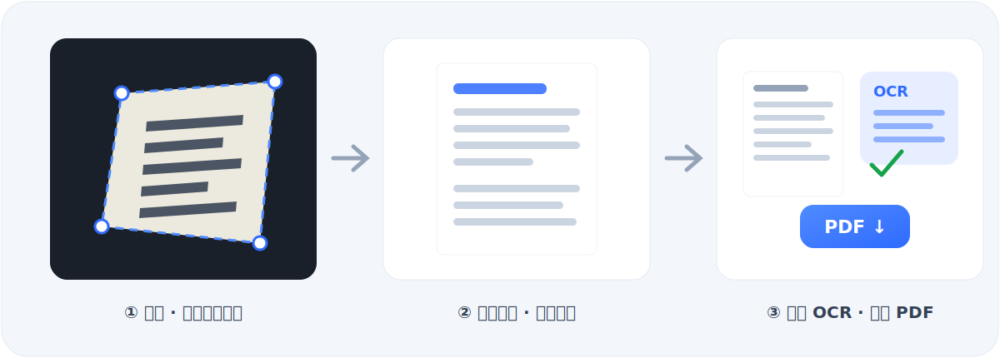

<div align="center">



<p>
  
  
  
  
  
</p>

**被扫描 App 的收费和广告气到，于是用 Rust 写了一个自己的。**
数据永远只在你的设备上 —— 无广告、无会员、无网络请求。

</div>

## 界面预览

<p align="center">
  
</p>

<!-- 真机截图：手机截图后放进 docs/ 并取消下面的注释（矢量图可同时保留或删除）
<p align="center">
  
  
  
</p>
-->

## 功能

- 拍照或相册导入，自动检测文档边缘，透视矫正拉直
- 手动四角微调（带放大镜）、旋转
- 五种滤镜：原图 / 增强（提亮去底色）/ 黑白文档 / 灰度 / 去阴影
- 多页文档：批量拍摄、排序、删除
- 导出 PDF（自适应页面或 A4 居中），可调图像质量
- 离线 OCR 中英文识别（PaddleOCR v4 模型 + 纯 Rust 推理，不联网）
- 一键分享到微信 / QQ 等（系统分享面板），图片和 PDF 均可
- 页面图片保存到系统相册（Pictures/ScanKing）
- 全文搜索：按文档名、标签、识别文字搜索
- 证件拼页：正反面合成一张 A4
- 文档库管理：重命名、标签、深色模式，磨砂质感 Clean UI
- 无广告、无会员、无网络请求，所有数据只存在你手机里

## 工作原理

<p align="center">
  
</p>

拍摄后自动完成：缩放灰度 → 自适应 Canny 边缘 → 轮廓四边形拟合 → 单应矩阵透视矫正（Catmull-Rom 双三次采样）→ 滤镜增强。OCR 由纯 Rust 推理引擎 tract 运行 PaddleOCR v4 模型，全程离线。

## 架构

```
core/       scanking-core：边缘检测、透视矫正、滤镜、PDF 生成、OCR、文档存储（纯 Rust，已含完整测试）
src-tauri/  Tauri 2 应用壳 + 命令层
ui/         前端界面（原生 JS，无构建步骤）
ui/models/  OCR 模型（运行 scripts/fetch_models 下载，keys.txt 已内置）
scripts/    模型下载脚本
```

图像处理全部为纯 Rust 实现（无 OpenCV、无原生动态库），交叉编译到 Android 零额外依赖。
OCR 用 [tract](https://github.com/sonos/tract) 推理 PaddleOCR ONNX 模型（Apache-2.0）。

---

## 从零到 APK（Windows）

### 1. 安装工具链

1. **Rust**：https://rustup.rs 下载运行 `rustup-init.exe`，一路默认。
   需要 rustc ≥ 1.77（建议直接最新 stable）。
2. **Visual Studio Build Tools**（rustup 会提示）：勾选"使用 C++ 的桌面开发"。
3. **Android Studio**：https://developer.android.com/studio 安装后打开
   SDK Manager，勾选安装：
   - SDK Platform（Android 14/API 34 或更高）
   - SDK Build-Tools
   - NDK (Side by side)
   - Android SDK Command-line Tools
   - Android SDK Platform-Tools
4. **JDK 17**：Android Studio 自带（`jbr` 目录），或单独装 Temurin 17。
5. 设置环境变量（系统设置 → 环境变量，按你的实际路径改）：

   ```
   ANDROID_HOME = C:\Users\<你>\AppData\Local\Android\Sdk
   NDK_HOME     = %ANDROID_HOME%\ndk\<版本号目录>
   JAVA_HOME    = C:\Program Files\Android\Android Studio\jbr
   ```

6. 安装 Rust 的 Android 目标和 Tauri CLI：

   ```
   rustup target add aarch64-linux-android armv7-linux-androideabi i686-linux-android x86_64-linux-android
   cargo install tauri-cli --version "^2"
   ```

### 2. 下载 OCR 模型（一次即可）

```
powershell -ExecutionPolicy Bypass -File scripts\fetch_models.ps1
```

模型（约 16 MB）会放进 `ui/models/`，打包时自动内置进 App，首次启动自动安装。
不下载模型 App 也能正常用，只是 OCR 功能会提示未安装。

### 3. 先在 Windows 桌面上跑起来（可选但推荐）

```
cargo tauri dev
```

会弹出一个手机比例的窗口，扫描、滤镜、PDF、OCR 全部功能都能直接调试（相机用摄像头或"相册导入"）。

### 4. 初始化 Android 工程（一次即可）

```
cargo tauri android init
cargo tauri icon app-icon.png
```

然后做两处小修改：

**a) 相机权限声明** — 编辑 `src-tauri/gen/android/app/src/main/AndroidManifest.xml`，
在 `<application>` 标签之前加入：

```xml
<uses-permission android:name="android.permission.CAMERA" />
<uses-feature android:name="android.hardware.camera" android:required="false" />
```

**b) 启动时请求相机权限** — 编辑
`src-tauri/gen/android/app/src/main/java/com/ng/scanking/MainActivity.kt`，替换为：

```kotlin
package com.ng.scanking

import android.Manifest
import android.content.pm.PackageManager
import android.os.Bundle
import androidx.core.app.ActivityCompat
import androidx.core.content.ContextCompat

class MainActivity : TauriActivity() {
  override fun onCreate(savedInstanceState: Bundle?) {
    super.onCreate(savedInstanceState)
    if (ContextCompat.checkSelfPermission(this, Manifest.permission.CAMERA)
        != PackageManager.PERMISSION_GRANTED) {
      ActivityCompat.requestPermissions(this, arrayOf(Manifest.permission.CAMERA), 1001)
    }
  }
}
```

如果编译报找不到 `androidx.core`，在 `src-tauri/gen/android/app/build.gradle.kts` 的
`dependencies { }` 里加一行：

```kotlin
implementation("androidx.core:core-ktx:1.13.1")
```

### 5. 真机调试 / 打包

手机开 USB 调试连电脑：

```
cargo tauri android dev          # 直接装到手机上运行
```

打正式 APK：

```
cargo tauri android build --apk
```

产物在 `src-tauri/gen/android/app/build/outputs/apk/`。

**签名**（发布用，自用 debug 包可跳过）：

```
keytool -genkey -v -keystore scanking.keystore -alias scanking -keyalg RSA -keysize 2048 -validity 10000
```

在 `src-tauri/gen/android/keystore.properties` 写入：

```
storeFile=C:\\路径\\scanking.keystore
storePassword=你的密码
keyAlias=scanking
keyPassword=你的密码
```

再按 [Tauri 官方 Android 签名文档](https://tauri.app/distribute/sign/android/) 在
`app/build.gradle.kts` 里启用 signingConfig（约 10 行，文档有完整示例）。

---

## 开发者自测

核心库自带完整测试（检测精度、矫正、滤镜、存储流程、PDF 结构）：

```
cargo test -p scanking-core
```

OCR 端到端测试（需先跑 fetch_models 下载模型；找一张含 "Hello 123" 文字的图片）：

```
$env:SK_MODELS="ui\models"; $env:SK_OCR_IMG="测试图.png"
cargo test -p scanking-core --test ocr_e2e -- --nocapture
```

## 常见问题

- **Gradle 下载慢/失败（国内网络）**：编辑 `src-tauri/gen/android/build.gradle.kts`，
  在 `repositories` 里把 `google()`、`mavenCentral()` 之前加上腾讯镜像：
  `maven("https://mirrors.cloud.tencent.com/nexus/repository/maven-public/")`。
  Gradle 本体镜像可在 `gen/android/gradle/wrapper/gradle-wrapper.properties` 里把
  `services.gradle.org` 换成 `mirrors.cloud.tencent.com/gradle`。
- **依赖要求更高 rustc**：装最新 stable 即可（`rustup update`）。若暂时用不了新版本，
  可锁旧版依赖：`cargo update kstring@2.0.3 --precise 2.0.2`。
- **相机预览黑屏**：确认做了第 4 步的两处修改并重新安装 App；个别机型 WebView 不放行
  getUserMedia 时，界面会自动提供"系统相机拍摄 / 相册导入"备用入口，功能不受影响。
- **OCR 速度**：纯 CPU 推理，整页识别在中端手机上约 3～10 秒；桌面上 1～2 秒。
- **数据存哪了**：全部在 App 私有目录（Android：`/data/data/com.ng.scanking/`），
  导出的 PDF 在其中 `library/exports/`，可用"打开 PDF"直接调系统查看器。

## 文档

| 文档 | 内容 |
|---|---|
| [开发指南](docs/开发指南.md) | 架构、数据流、命令 API、如何加功能 |
| [避坑手册](docs/避坑手册.md) | 开发全程踩过的坑：PowerShell / Cargo / tract / Tauri Android JNI 四连坑 |
| [美术规范](docs/美术规范.md) | Clean UI 设计令牌：色板、圆角、阴影、磨砂玻璃配方、动效 |
| [项目记忆](docs/项目记忆.md) | 接手必读：决策理由、当前状态、已知限制、路线图 |

## 致谢

- [Tauri](https://tauri.app) — 跨平台应用框架
- [tract](https://github.com/sonos/tract) — 纯 Rust ONNX 推理引擎
- [PaddleOCR](https://github.com/PaddlePaddle/PaddleOCR) / [RapidOCR](https://github.com/RapidAI/RapidOCR) — OCR 模型（Apache-2.0）
- [image-rs](https://github.com/image-rs/image) / imageproc — Rust 图像处理生态

欢迎 Issue 和 PR。

## 法务说明

- 本项目为功能同类的原创实现，代码全部原创；请勿使用他人商标（名称/图标）发布。
- OCR 模型来自 PaddleOCR（Apache-2.0），字典文件 `ui/models/keys.txt` 同属其发行内容。
- 本项目采用 MIT 许可。
